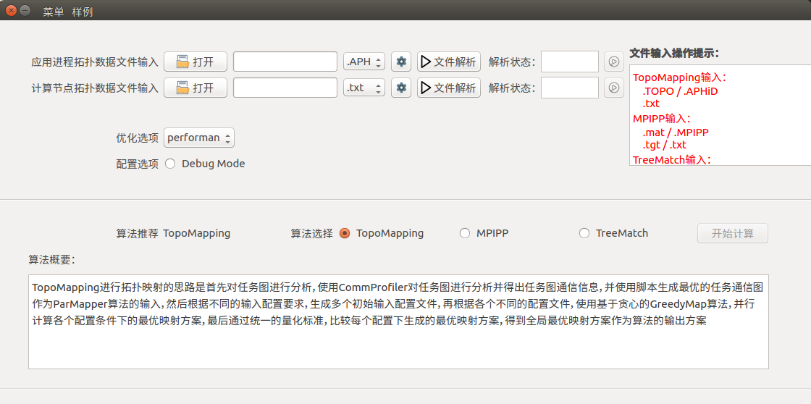
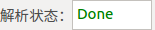
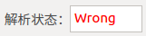
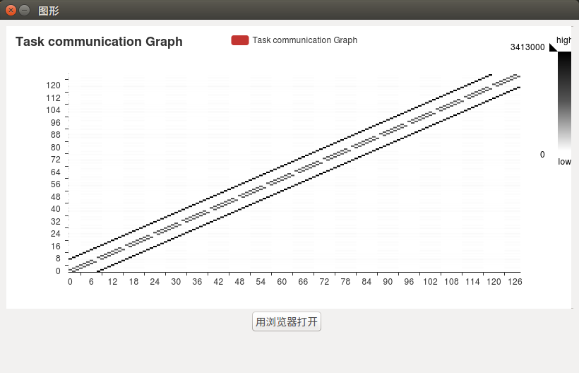
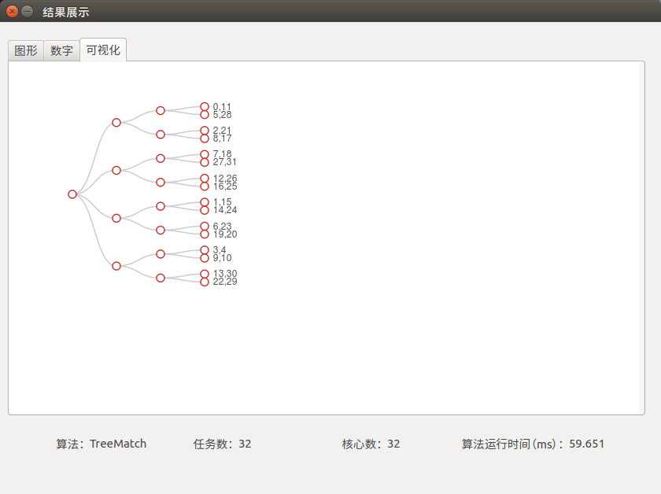

# 📃 PACOS


基于拓扑映射的并行应用通信性能优化系统
*(Parallel Application Communication Optimization System based on Topology Mapping)*

Github 地址: <https://github.com/King-ofwolf/PACOS>
作者：汪圣灵

[English README](README.en.md)

## 📣 简介

[PACOS](https://github.com/King-ofwolf/PACOS) 是基于拓扑映射的并行应用通信性能优化系统，能够使用并行应用通信拓扑数据文件和系统网络拓扑数据文件计算生成两者的映射序列，其中集成了[TreeMatch](http://treematch.gforge.inria.fr/)、[TopoMapping](https://dl.acm.org/citation.cfm?id=3079104)、[MPIPP](https://dl.acm.org/citation.cfm?id=1183451)三种算法，以及算法推荐功能和数据可视化功能。

## ✨ 特性

* 提供交互式界面，为研究人员提供简单方便的途径来进行并行应用通信性能优化相关工作
* 提供算法推荐功能，能够根据网络结构和优化选项推荐合适的算法
* 提供数据可视化功能，能够将并行应用通信拓扑数据、系统网络拓扑数据、映射方案进行可视化

## ⏳ 版本

### V2.0

> 支持 Python2.7
> 添加了TreeMatch、MPIPP、TopoMapping算法

## 🔰 安装

**git源码安装**
```bash
$ git clone https://github.com/King-ofwolf/PACOS.git
$ cd PACOS
$ pip install -r requirements.txt
```
**zip源码安装**

在<https://github.com/King-ofwolf/PACOS>的master分支下载源码包，名字为PACOS-master.zip
```bash
$ unzip PACOS-master.zip
$ cd PACOS-master
$ pip install -r requirements.txt
```
## 📝 使用

### 本地环境及启动方式
> python 2.7
> 
在源码目录下，运行命令：
```bash
$ python System_windows.py
```
即可打开系统图形化界面


### 界面操作方式

控件名称 | 控件图形
--------|-------
[打开]()|
[文件类型]()|
[配置]()|
[确认]()|
[播放]()|
[文件解析]()|
[解析状态栏]()|
[开始计算]()|

#### &diams;数据文件输入：

- 通信拓扑文件输入：


> 1. 点击[打开]()按钮，在弹出的文件浏览器中选择所需要输入的文件/在输入框中输入文件的地址
> >若需要输入的文件类型为目录结构，则需要将输入框后的[文件类型]()下拉菜单选择为**Dir**
> 
> 2. 根据输入的文件类型，在[文件类型]()下拉菜单中选择对应的类型
> 3. 点击[配置]()按钮，在弹出的配置窗口中输入对应信息，并点击[确认]()

- 网络拓扑文件输入：


> 1. 点击[打开]()按钮，在弹出的文件浏览器中选择所需要输入的文件/在输入框中输入文件的地址
> 2. 根据输入的文件类型，在[文件类型]()下拉菜单中选择对应的类型
> 3. 点击[配置]()按钮，在弹出的配置窗口中输入对应信息，并点击[确认]()

#### &diams;文件解析及可视化

> 点击[文件解析]()按钮，若解析成功，则在[解析状态栏]()显示绿色Done，否则弹出错误提示，并显示红色Wrong
> 解析成功后，点击[播放]()按钮，则可查看数据可视化后的图形
> > 网络拓扑图目前只支持.txt格式的文件进行可视化



#### &diams;算法配置及算法推荐

文件输入及配置完成并解析成功后，即可进行算法的配置。配置完成后将自动推荐算法，并勾选被推荐的算法。
> - [优化选项]():决定算法推荐，performance为优先性能，efficiency为优先效率
> - [Debug Mode]():勾选则开启系统调试模式，调试信息将输出到log文件中

若选中的算法是TreeMatch算法，则相应有以下配置项
> - [-b]() 绑定文件（binding constraint file）
> - [-d]() 取消拓扑优化 （disable topology optimization）
> - [-m]() 优化目标 （evaluation metric）在下拉菜单中选择对应优化目标(SUM_COM/MAX_COM/HOP_BYTE)

#### &diams;算法计算及结果展示

虽然算法推荐功能会根据网络结构和用户选择的优化选项自动推荐算法并选择对应算法，但用户仍然可以勾选其他算法。点击[开始计算]()，则系统将根据输入的数据和参数进行算法计算，计算过程中系统为不可用状态，待计算结束后，将弹出结果展示界面。
> 结果展示界面包括散点图、映射序列、可视化图形以及算法运行时间
> - 散点图：横坐标为任务序列号，纵坐标为节点序列号
> - 映射序列：第一列为任务序列号，第二列为节点序列号
> - 可视化图形：树状图为网络结构，叶子节点从上至下依次为0-n号节点，节点上的数字组为分配到当前节点的任务序列号



### 快捷样例数据输入 

为方便开发测试，在系统的菜单栏中添加了[样例]()菜单，点击选择对应的算法和对应的样例即可完成所有相应的配置项，直接点击两个[文件解析]()按钮，完成解析后，即可点击[开始计算]()按钮，进行算法计算。

## 🔖 样例数据

> 样例数据位于 examples 文件夹下

更多详细文档，请访问

* [中文文档](README.md)
* [English Documentation](README.en.md)

## 😉 Author

PACOS主要由以下开发者开发

* [@King-ofwolf](https://github.com/King-ofwolf/)

## 💡 开发
等待更新...
### 代码结构
### 代码库管理
### 代码自动编译


